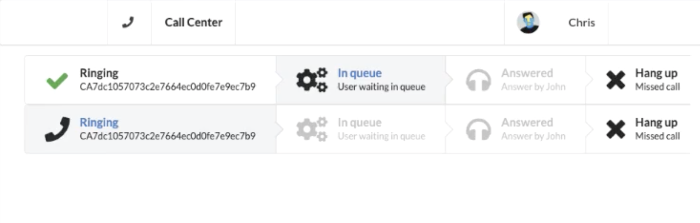

# SMS Call Center App

Call center app that enables a customer service employee to receive customer calls by phone, put the calls in a call waiting queue, and then answer calls one at a time via a web-based user interface.

## Technology Stack

### Back End

- Twilio API
- TwiML Apps
- Node.js
- Express
- Socket.IO

### Front End

- React
- Semantic UI React
- Socket.IO Client

## Developer

[Christopher Najafi](https://www.chrisnajafi.com/)
